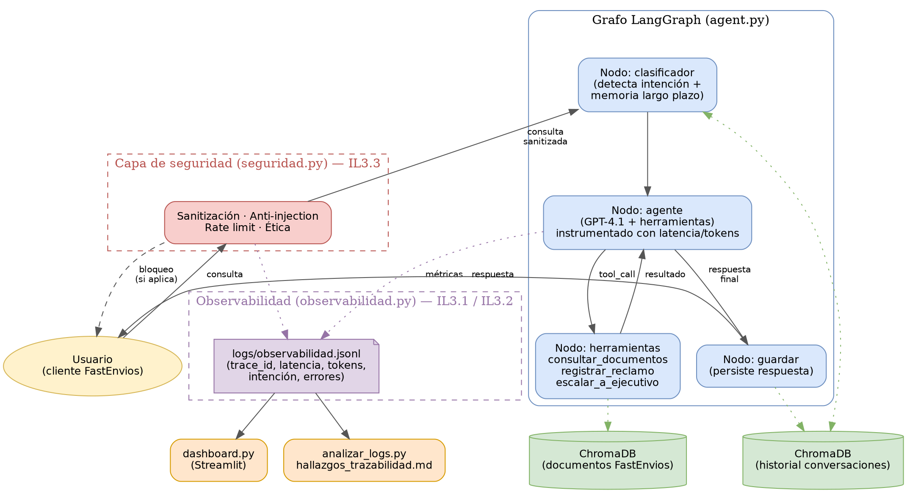

# Fasty — Agente Virtual de FastEnvios Ltda.

Agente de atención al cliente impulsado por IA para FastEnvios Ltda., empresa chilena de despacho a domicilio. Construido con LangGraph, GPT-4.1 (vía GitHub Models) y ChromaDB, con una capa de observabilidad, trazabilidad y seguridad desarrollada en la Evaluación Parcial N°3.


# 1. Arquitectura


El agente sigue un flujo de grafo con 4 nodos principales:

1. Clasificador: detecta la intención de la consulta (política de envío, seguimiento, reclamo, escalada) y recupera contexto histórico semántico desde ChromaDB.
2. Agente: el LLM (GPT-4.1) decide si responder directamente o invocar una herramienta.
3. Herramientas: `consultar_documentos`, `registrar_reclamo`, `escalar_a_ejecutivo`.
4. Guardar: persiste la respuesta final en la memoria de largo plazo (ChromaDB).

Antes de llegar al clasificador, cada consulta pasa por una capa de seguridad (sanitización, anti prompt-injection, verificación ética y límite de solicitudes). Cada interacción completa queda registrada en `logs/observabilidad.jsonl` con métricas de latencia, tokens y trazabilidad.


# 2. Estructura del repositorio

```
FastEnviosLtda/
├── agent.py                     # Grafo LangGraph principal (clasificador → agente → herramientas → guardar)
├── app.py                       # Versión simplificada del agente (EP2)
├── observabilidad.py            # Registro de métricas y trazabilidad (IL3.1 / IL3.2)
├── seguridad.py                 # Protocolos de seguridad y uso responsable (IL3.3)
├── generar_trafico_prueba.py    # Genera tráfico de prueba real para poblar los logs
├── analizar_logs.py             # Analiza logs.jsonl y genera hallazgos_trazabilidad.md
├── dashboard.py                 # Dashboard de monitoreo en Streamlit
├── hallazgos_trazabilidad.md    # Hallazgos documentados a partir de los logs reales
├── documentos/                  # Base de conocimiento (políticas, FAQ, reglamento)
├── logs/
│   └── observabilidad.jsonl     # Registro de todas las interacciones (evidencia real)
├── docs/
│   ├── diagramas/
│   │   └── arquitectura_fasty.png
│   └── capturas_dashboard/
│       ├── fig1_kpis_latencia.png
│       ├── fig2_distribucion_intenciones.png
│       ├── fig3_herramientas_utilizadas.png
│       └── fig4_fuentes_fallas_trazabilidad.png
├── chroma_db/                   # Vectorstore de documentos (se genera automáticamente)
├── chroma_historial/            # Vectorstore de historial de conversaciones (automático)
├── reclamos_registrados.json    # Reclamos registrados por la tool registrar_reclamo
├── requirements.txt
└── README.md
```


# 3. Instalación

```bash
# 1. Clonar el repositorio
git clone https://github.com/pri-calderonn/FastEnviosLtda.git
cd FastEnviosLtda

# 2. Crear y activar entorno virtual
python -m venv venv
# Windows (PowerShell):
(Set-ExecutionPolicy -Scope Process -ExecutionPolicy RemoteSigned) ; (& venv\Scripts\Activate.ps1)
# Linux/Mac:
source venv/bin/activate

# 3. Instalar dependencias
pip install -r requirements.txt
```

Crea un archivo `.env` en la raíz del proyecto con:

```
GITHUB_TOKEN=tu_token_de_github_models
OPENAI_BASE_URL=https://models.inference.ai.azure.com
OPENAI_EMBEDDINGS_URL=https://models.inference.ai.azure.com
```

> Nota: el proveedor usado (GitHub Models, tier gratuito) tiene un límite de 150 solicitudes diarias por modelo. Si ves errores `RateLimitError`, es este límite — está documentado como hallazgo en `hallazgos_trazabilidad.md`.


# 4. Cómo ejecutar el sistema

# 4.1. Conversar con el agente
```bash
python agent.py
```

# 4.2. Generar tráfico de prueba (para poblar los logs de observabilidad)
```bash
python generar_trafico_prueba.py
```
Ejecuta 14 consultas variadas + pruebas de consistencia (misma consulta repetida 3 veces) contra el agente real, registrando cada interacción en `logs/observabilidad.jsonl`.

# 4.3. Analizar los logs y generar hallazgos
```bash
python analizar_logs.py
```
Lee `logs/observabilidad.jsonl` (no requiere conexión a la API) y genera/actualiza `hallazgos_trazabilidad.md` con métricas de latencia, tasa de error, distribución de intenciones y posibles fallas de precisión.

# 4.4. Levantar el dashboard de monitoreo
```bash
streamlit run dashboard.py
```
Abre automáticamente `http://localhost:8501` con los gráficos interactivos construidos a partir de `logs/observabilidad.jsonl`.

# 5. Observabilidad y seguridad (Evaluación Parcial N°3)

- **`observabilidad.py`** — Registra latencia, tokens, uso de fuentes documentales, errores y trazabilidad (`trace_id`) por interacción. *(IL3.1, IL3.2)*
- **`seguridad.py`** — Sanitiza inputs, bloquea prompt injection, valida que la salida no filtre datos sensibles, limita solicitudes por sesión y filtra temas fuera de alcance.
- **`analizar_logs.py`** — Detecta cuellos de botella (p90 de latencia), tasa de error, y posibles fallas de precisión.
- **`dashboard.py`** — Visualiza todas las métricas anteriores en tiempo real.

Los hallazgos completos, con evidencia (`trace_id`) y recomendaciones fundamentadas, están documentados en [`hallazgos_trazabilidad.md`](./hallazgos_trazabilidad.md) y en el informe técnico entregado (`Informe_EP3_ISY0101_Fasty.docx`).


# 6. Limitaciones conocidas

- El agente no cuenta con una integración real a un sistema de tracking de pedidos (la intención "seguimiento" no tiene una herramienta dedicada).
- El clasificador de intención por palabras clave puede confundir "reclamo" con "seguimiento" cuando ambas categorías comparten términos (ver hallazgo documentado).
- La cuota gratuita del proveedor de LLM (150 solicitudes/día) no es adecuada para un entorno de producción real.


## 7. Versiones principales

```
langchain==1.3.4
langchain-community==0.4.2
langchain-core==1.4.1
langchain-openai==1.2.2
langgraph==1.2.4
langgraph-prebuilt==1.1.0
langgraph-checkpoint==4.1.1
chromadb==1.5.9
openai==2.41.0
streamlit
pandas
```


Autores: Gustavo Soto --- Priscila Calderón — ISY0101 Ingeniería de Soluciones con IA, DuocUC 2026